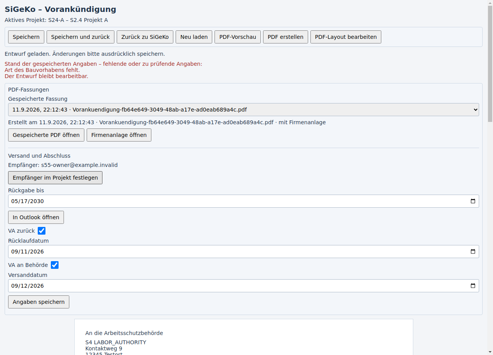

# S5.5 – Vereinfachter Vorankündigungsablauf

Stand 11.09.2026. Nutzerauftrag: den vorhandenen S5.4-Prozess auf PDF, Outlook,
optionale Rücklauferinnerung und zwei manuelle Abschlussangaben reduzieren.
Basis `main` / `e3f1197f388be27d1381ef84838bacd18c7825ed`.
Ergebnisbranch `codex/sigeko-va-einfacher-workflow`.
Kit unverändert auf `5e0d551d93e97c32d169ea6d5107186a44ecd47f`.

**Implementiert; Windows-/Outlook-Abnahme und Übernahme in main stehen aus.**

## Ergebnis

1. Im SiGeKo-Projektbereich „Vorankündigung – Empfänger“ freie E-Mail-Adressen
   eingeben oder vorhandene Firmen-/Personenadressen auswählen; ausdrücklich speichern.
   Die Auswahl gilt nur für das Projekt. Es werden keine zentralen Kontakte angelegt.
2. Vorankündigung speichern und PDF mit dem bestehenden Weg erstellen.
   PDF und ggf. Firmenanlage liegen unverändert in der Projektablage. Gedruckt wird
   wie bisher über „Gespeicherte PDF öffnen“ und den Druckweg der PDF-Vorschau.
3. Bei der gewählten PDF-Fassung „Rückgabe bis“ angeben und „In Outlook öffnen“.
   Outlook erhält Empfänger, Betreff, Vorankündigungstext und geprüfte PDF-Anlagen.
   Im Body stehen Rückgabedatum und die vom anfänglichen Outlook-Sendekonto
   ermittelte SMTP-Adresse. Änderungen an Text/Empfängern erfolgen in Outlook.
4. Nach Schließen des Outlook-Entwurfs fragt BBM „Erinnerung erstellen?“.
   Auch Verwerfen führt zu dieser Frage. Nein/Abbrechen erzeugt nichts.
   Ja legt „VA schon zurück“ in Outlook an: fällig am Rückgabedatum, Erinnerung 09:00 Uhr.
5. In BBM bleiben nur „VA zurück“ mit Rücklaufdatum und „VA an Behörde“ mit
   Versanddatum. Anhaken schlägt heute vor; Datum ist änderbar, Abhaken löscht es.
   „Angaben speichern“ speichert diesen Bereich. „Speichern“ und „Speichern und zurück“
   sichern auch geänderte Abschlussangaben; Fehler erhalten den Entwurf.

Es gibt keine BBM-Rücklaufverfolgung, keine Prozessampel, keinen Rücklaufimport
und keinen zusätzlichen BBM-Mailtexteditor in dieser Oberfläche.
Die bestehenden Vollständigkeits-/Behördenhinweise des Formulars bleiben davon getrennt.

## Daten und technische Grenzen

- Empfänger unter `project_settings` / `sigeko.preNotification.recipients`, mit
  eigener Revisionsprüfung. Vorhandene gemeinsame Adressdienste liefern Vorschläge.
- Zwei nullable Datumsfelder ergänzen die vorhandene Workflowzeile je PDF-Fassung.
  Alte PDF-/Rücklaufdateien und historische Übergabefelder werden nicht gelöscht
  oder in manuelle Bestätigungen umgedeutet. Alte Servicewege bleiben kompatibel,
  die vereinfachte Oberfläche verwendet ausschließlich die neuen Wege.
- V10-Projektarchive erhalten die neuen Daten. Exakte V9-Archive werden mit leeren
  manuellen Daten importiert; ältere Formate bleiben unterstützt. Unbekannte oder
  ungültige Daten, fremde Projekte und geänderte Dateien werden vor Schreibaktionen abgewiesen.
- Fachinhalt bleibt im SiGeKo-Service. Der getrennte gemeinsame Outlookadapter
  kennt nur Empfänger, Text, Dateien und optionale Aufgabe; kein Protokoll-/Rechnungsimport.
- Das echte klassische Outlook wird über COM geöffnet. BBM beobachtet nur das Ende
  des modalen Entwurfsfensters, nicht den Versand. Kein automatischer Versand,
  keine spätere Synchronisation, kein automatisches Löschen/Abhaken von Outlook-Aufgaben.
- Bei mehreren Konten und nicht eindeutig ermittelbarem Sendekonto wird vor Öffnen
  abgebrochen. Wird das Von-Konto im geöffneten Outlookfenster geändert, muss die
  Rücksendeadresse im bereits erzeugten Body dort ebenfalls angepasst werden.
- Eine unbestätigte Aufgabenerstellung wird als Fehler angezeigt, niemals automatisch
  wiederholt. Lizenz/Projektzustand werden vor Aufgabenanlage erneut geprüft.

## Nachweise

- Gezielte Tests: Datum/CAS/Archivschutz, freie/übernommene Empfänger, Projekt-/Fassungswechsel,
  Migration mit historischem Rücklauf, V9/V10-Transfer, direkte Mail samt Originalbytes,
  Lizenz-/Abbruchgrenzen, Nein/Ja/Transportfehler, verspätete Antworten, vollständige Editorrefs.
- Vollständiger Testlauf: **2069 PASS / 97 Bestandsfehler**, gegenüber **2040 / 97**
  auf main. Exakt gleiche Fehlernamen/-häufigkeiten, keine neuen Fehler. 13 entfallene
  S5.4-UI-Tests durch 9 passende S5.5-Tests ersetzt; vier Prüfungen nur umbenannt.
  Alle übrigen vorherigen PASS-Prüfungen weiterhin ausgeführt und bestanden.
- Vollständiger Testvergleich: `SIGEKO_S5_5_TESTVERGLEICH.json`; derselbe main-Baum,
  dieselbe Electron-ABI und derselbe Kit-Pin als Vergleich. Bekannte allgemeine
  Testfehler werden nicht als behoben ausgegeben.
- Reale Linux-Electron-Abnahme: `sigeko-s5-5/form-result.json`, 28 Prüfschritte,
  keine Rendererfehler. Produktives Preload/IPC/SQLite und tatsächliche Chromium-PDFs;
  nur der Outlook-Betriebssystemaufruf ist kontrolliert simuliert.
- Tatsächlich geklickt/geprüft: Projekt-Empfänger speichern; PDF erstellen und
  historische Dateien öffnen; Transportfehler und erneuter direkter Outlook-Aufruf;
  Checkboxen/Datumsangaben speichern; Fassung wechseln; Datenbank schließen/öffnen;
  Archivschutz; alle Bedienelemente bei 1280×950, 560×950 und 560×480 erreichbar.
- UI-Entscheidung vor Umsetzung: `SIGEKO_S5_5_UI_ENTWURF.md`.
  Registry 38, SiGeKo-Grunddaten 219 Ziele inkl. Launcher, VA 134 inkl. Launcher.
  Alle 22 vereinfachten Workflowziele und 11 Empfängerziele explizit registriert.
- Unabhängiger Review: zwei Datenverlustfälle gefunden und behoben; bestätigte
  Nachprüfung für Speichern-und-zurück und Entwurfserhalt bei Speicherkonflikt.
- Bestandsmeldungen aus der Druckpipeline zu Schriftdateien und fehlendem
  `tableLayouts:getOne` im Testhost bestehen; PDF-Erstellung und UI-Abnahme liefen durch.



## Noch erforderliche Windows-Abnahme

Die bestandene S5.4-Abnahme belegt nicht die neue S5.5-Erinnerungsfunktion.
Im **isolierten, aktualisierten Testcheckout mit dem passenden Kit** ausführen:

```powershell
npm run fix:electron-deps
npm run test:sigeko:s5.5:outlook
```

Der Test nutzt ein eigenes BBM-Profil und fiktive Projektdaten. Er erzeugt zwei
Outlook-Entwürfe mit echten PDF-Anlagen, die geprüft und verworfen werden.
Erster Durchlauf Erinnerung Nein, zweiter Ja. Nur Ja erzeugt eine echte Testaufgabe
im vorhandenen Outlookkonto; Datum/09:00 Uhr prüfen und Testaufgabe danach selbst löschen.
Abschließend bestätigt der Nutzer die tatsächliche Sichtprüfung. Berichtpfad wird ausgegeben.
Keine Testmail versenden. Druck über die bestehende PDF-Vorschau separat praktisch prüfen.

Zusätzlich Oberfläche mit `npm run test:sigeko:s2.4:form:manual` ansehen; dort ist
Outlook absichtlich simuliert. Kein Ersatz für die vorherige reale Outlook-Abnahme.

Der normale Kit-Checkout `C:\01_Projekte\UI-Editor-kit` enthält Steffens eigene
ungesicherte Editorarbeit. Dieses Paket verändert ihn nicht. Für S5.5 das funktionierende
Testpaar verwenden; dauerhaftes Aktualisieren des normalen Kits bleibt ein eigener Schritt.
Rechnung #275, S6/SiGePlan und sonstige Ausbaupakete sind nicht Bestandteil.
